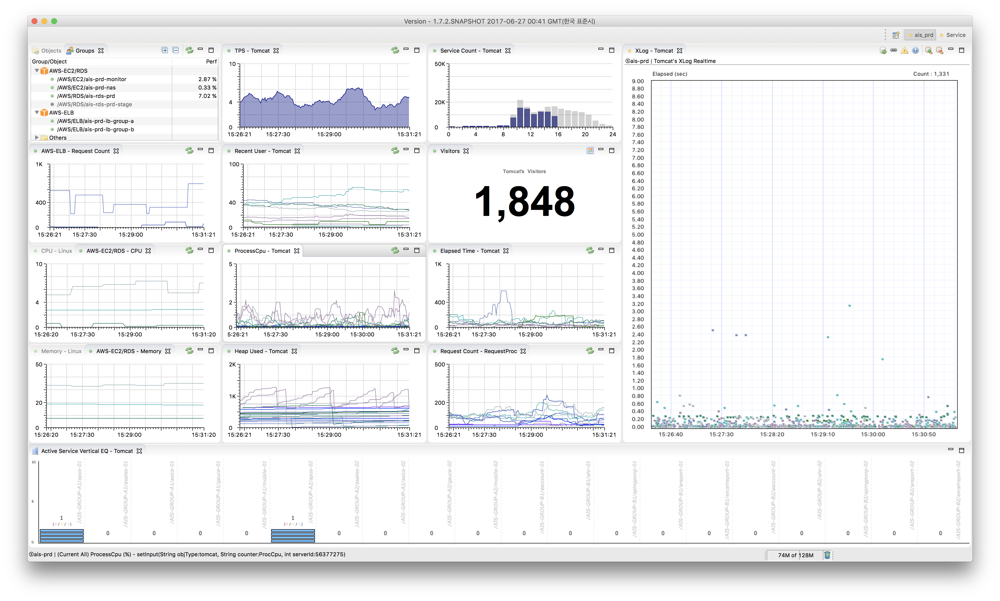

# scouter-pulse-aws-monitor
AWS의 CloudWatch를 이용하여 EC2 / RDS / ELB의 카운터 정보를 수집하고 Collector 서버로 전송함으로써 다음과 같이 클라이언트에서 카운터 정보를 표시할 수 있다.

>

## Requirements
* Collector 서버에 net\_http\_server\_enabled 옵션이 활성화 되어 있어야 한다.
* 아이콘이 정상적으료 표시되기 위해서 1.7.2 버전 이상의 socuter.server 및 scouter.client가 필요하다. (하위 버전에서 아이콘 표시를 제외하고 기능상의 문제는 없음)

## 모니터링 대상 인스턴스 등록
* EC2, RDS, ELB 목록 중 모니터링 대상 항목의 Tag에 Key는 scouter.monitoring, Value는 true(True, TURE 가능)로 설정한다.
* EC2, RDS는 CPU, Memory 정보를 수집하며, ELB는 Request Count 정보를 수집하다. EC2의 메모리 정보 수집을 위해서는 http://docs.aws.amazon.com/ko_kr/AWSEC2/latest/UserGuide/mon-scripts.html 를 참고하여 메모리 모니터링이 수행되고 있어야 한다.

## 실행방법
* application.yml 파일에 필요한 파라메타를 입력하고 빌드한 경우 별다른 파라메타 없이 java -jar scouter-pulse-aws-monitor.jar 와 같이 실행할 수 있다.
* 실행 시 파라메타를 입력할 경우 java -jar -Daws.accessKeyId=xxx -Daws.secretKey=xxx -Daws.scouter.host=xxx -Daws.scouter.port=xxx scouter-pulse-aws-monitor.jar 와 같이 실행할 수 있다.
  (Role 등 별도의 AWS 인증 방법을 사용할 경우 aws.accessKeyId 및 aws.secretKey는 생략할 수 있다.)
  참고 : http://docs.aws.amazon.com/sdk-for-java/v1/developer-guide/credentials.html
   
